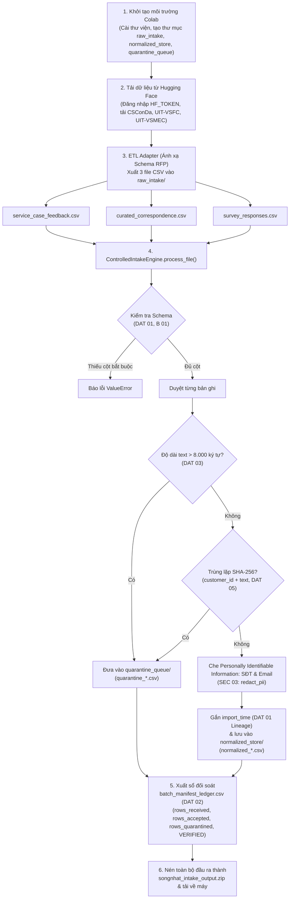

# Flow xử lý: 01_controlled_intake_colab (1).ipynb

```mermaid
flowchart TD
    A["1. Khởi tạo môi trường Colab<br/>(Cài thư viện, tạo thư mục raw_intake, normalized_store, quarantine_queue)"] --> B["2. Tải dữ liệu từ Hugging Face<br/>(Đăng nhập HF_TOKEN, tải CSConDa, UIT-VSFC, UIT-VSMEC)"]
    B --> C["3. ETL Adapter (Ánh xạ Schema RFP)<br/>Xuất 3 file CSV vào raw_intake/"]
    C --> C1["service_case_feedback.csv"]
    C --> C2["curated_correspondence.csv"]
    C --> C3["survey_responses.csv"]

    C1 & C2 & C3 --> D["4. ControlledIntakeEngine.process_file()"]
    D --> E{"Kiểm tra Schema<br/>(DAT 01, B 01)"}
    E -- "Thiếu cột bắt buộc" --> ERR["Báo lỗi ValueError"]
    E -- "Đủ cột" --> F["Duyệt từng bản ghi"]

    F --> G{"Độ dài text > 8.000 ký tự?<br/>(DAT 03)"}
    G -- "Có" --> Q["Đưa vào quarantine_queue/<br/>(quarantine_*.csv)"]
    G -- "Không" --> H{"Trùng lặp SHA-256?<br/>(customer_id + text, DAT 05)"}
    H -- "Có" --> Q
    H -- "Không" --> I["Che Personally Identifiable Information: SĐT & Email<br/>(SEC 03: redact_pii)"]
    I --> J["Gắn import_time (DAT 01 Lineage)<br/>& lưu vào normalized_store/<br/>(normalized_*.csv)"]

    J & Q --> K["5. Xuất sổ đối soát<br/>batch_manifest_ledger.csv (DAT 02)<br/>(rows_received, rows_accepted, rows_quarantined, VERIFIED)"]
    K --> L["6. Nén toàn bộ đầu ra thành<br/>songnhat_intake_output.zip & tải về máy"]
```
